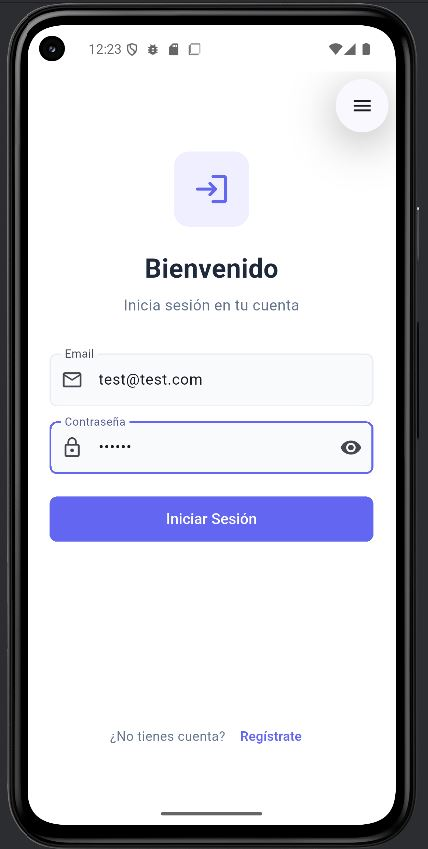
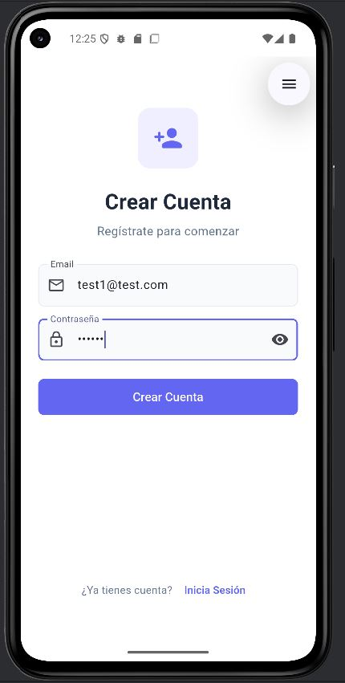
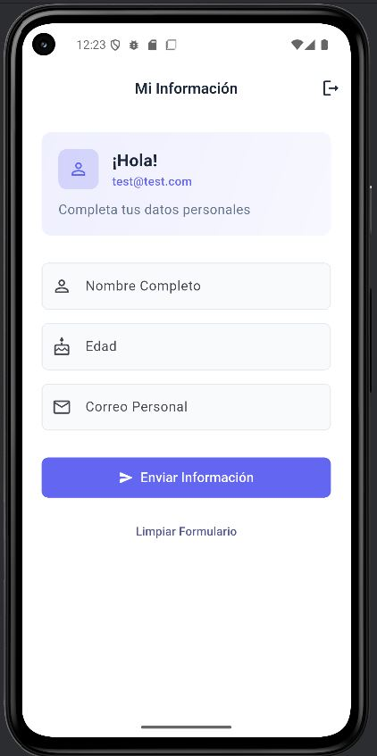

# Mini App Flutter

## Descripción del Proyecto

Aplicación móvil desarrollada en Flutter que implementa un sistema completo de autenticación con Firebase y un formulario de datos personales con validaciones. La aplicación permite a los usuarios registrarse, iniciar sesión y completar un formulario con su información personal.

## Características Principales

- **Autenticación completa**: Registro e inicio de sesión con Firebase Authentication
- **Formulario validado**: Captura de datos personales con validaciones en tiempo real
- **Interfaz moderna**: Diseño limpio y responsivo siguiendo principios de Material Design
- **Gestión de estado**: Manejo eficiente del estado de la aplicación con setState

## Capturas de Pantalla

### Pantalla de Inicio de Sesión


### Pantalla de Registro


### Formulario de Datos Personales


### Confirmación de Datos


## Funcionalidades

### Sistema de Autenticación

**Registro de Usuario:**
- Validación de formato de email
- Validación de contraseña (mínimo 6 caracteres)
- Creación de cuenta en Firebase Authentication
- Navegación automática al formulario tras registro exitoso
- Manejo de errores con mensajes descriptivos

**Inicio de Sesión:**
- Autenticación con email y contraseña
- Validación de credenciales contra Firebase
- Navegación automática al formulario tras login exitoso
- Recuperación de sesión automática

**Cierre de Sesión:**
- Confirmación antes de cerrar sesión
- Limpieza segura de la sesión actual
- Regreso a pantalla de login

### Formulario de Datos Personales

**Campos del Formulario:**
- **Nombre**: Campo obligatorio para nombre completo
- **Edad**: Campo numérico obligatorio, debe ser mayor a 0
- **Correo**: Campo obligatorio con validación de formato email

**Validaciones Implementadas:**
- Validación en tiempo real de campos obligatorios
- Verificación de formato de email con expresiones regulares
- Validación numérica para el campo edad
- Mensajes de error específicos para cada tipo de validación

**Confirmación de Datos:**
- Presentación de datos ingresados en dialog modal
- Opción para limpiar formulario y reingresar datos
- Interfaz clara y organizada para revisión

## Estructura del Proyecto

```
lib/
├── main.dart                 # Punto de entrada y configuración
├── screens/
│   ├── login_screen.dart     # Pantalla de inicio de sesión
│   ├── register_screen.dart  # Pantalla de registro
│   └── form_screen.dart      # Pantalla del formulario
└── screenshots/              # Capturas de pantalla
```